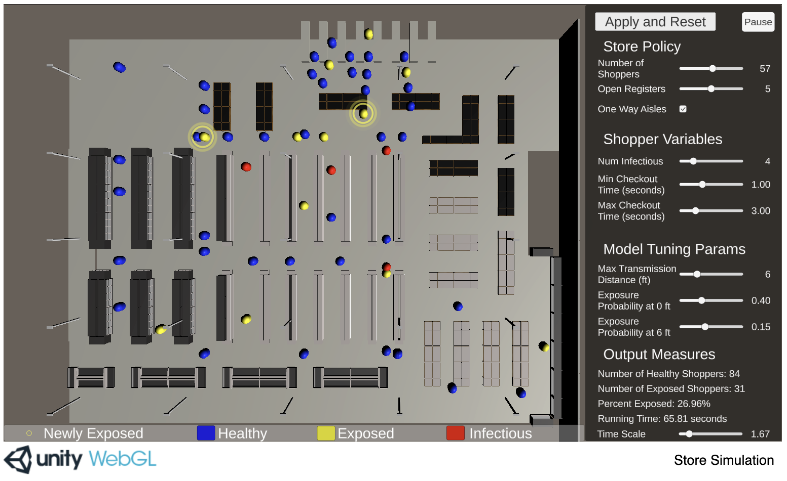

# Grocery Store Simulation:

See the [blog post](https://blogs.unity3d.com/2020/05/08/exploring-new-ways-to-simulate-the-coronavirus-spread/) and [white paper](https://resources.unity.com/automotive-transportation-manufacturing/simulation-coronavirus-whitepaper) for more details.

# Disclaimer
THIS PROJECT (INCLUDING ALL INFORMATION AND DATA ASSOCIATED WITH IT) IS "AS IS" AND "AS AVAILABLE". YOU ARE SOLELY RESPONSIBLE FOR YOUR USE OF THE PROJECT AND UNITY TECHNOLOGIES AND ITS AFFILIATES MAKE NO REPRESENTATIONS OR WARRANTIES OF ANY KIND CONCERNING THE PROJECT OR ITS USE; SEE LICENSE TERMS FOR DETAILS. 

Without limiting the foregoing, we want to be really clear that __we are not epidemiologists or doctors, and nothing in this project can or should be taken as medical or other guidance or advice of any kind__. This is merely a conceptual model based on certain parameters and highly simplified. __Guidance or advice concerning Coronavirus, how it is spread, what steps you might take to avoid infection, or anything else health-related should be directed to a competent health professional.__

# About

Shoppers are colored according to their health status:
* Blue shoppers are healthy (suceptible).
* Red shoppers are infectious.
* Yellow shoppers have been exposed by a infectious shopper, but are not themselves infectious.

# More Simulation Details 
* [Infection Model](docs/InfectionModel.md)
* [Waypoint Graph and Shopper Movement](docs/WaypointGraphAndMovement.md)
* [Queueing Model](docs/QueueingModel.md)
* [Running on Unity Game Simulation](docs/GameSim.md)
