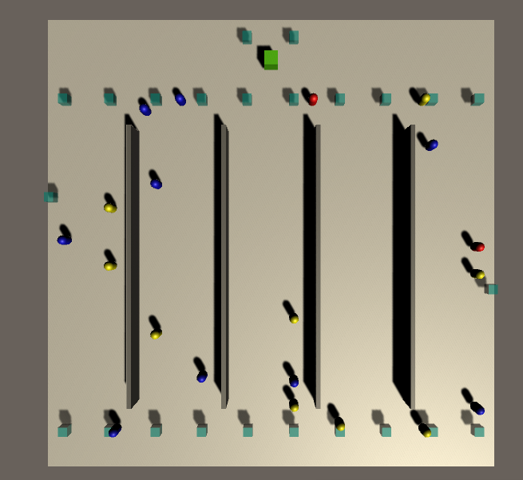

# Grocery Store Simulation:

**Blog post coming soon**

# About

Shoppers are colored according to their health status:
* Blue shoppers are healthy (suceptible).
* Red shoppers are infectious.
* Yellow shoppers have been exposed by a infectious shopper, but are not themselves infectious.

# Disclaimer
Disclaimer! We want to be really clear that we are experts in 3D simulation, not epidemiology, and that this is just a 
conceptual demonstration. In particular, the model for how the infection spreads is very simplistic and the movement 
model for the shoppers is also highly simplified.

# More Simulation Details 
* [Infection Model](docs/InfectionModel.md)
* [Waypoint Graph and Shopper Movement](docs/WaypointGraphAndMovement.md)
* [Queueing Model](docs/QueueingModel.md)
